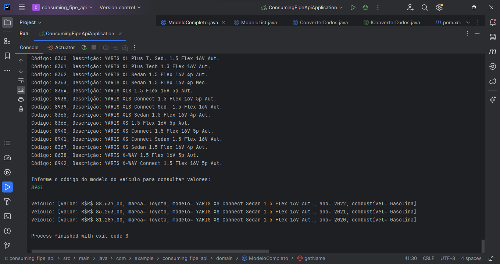

# Alura_consumindo_API_fipe
Esse projeto em console, desenvolvido com base na recomendação do curso "Spring Boot 3: desenvolva uma API Rest em Java", busca praticar tais conteúdos, mediante o consumo de uma API de consulta de tabela FIPE. Com base no tipo de veículo, marca, modelo e código do modelo(dados fornecidos pelo usuário), é possível enviar uma requisição. Em seguida, gera-se um formato JSON com os dados retornados, os quais são modelados em objetos e manipulados, assegurando a comparação do preço do modelo de veículo em diferentes anos. Com tal projeto, foi praticado a utilização de listas, coleções de dados, funções lambdas, streams, geração de estatísticas e vários outros recursos do Java. A aplicação implementa a interface CommandLineRunner para ser executada e a desserialização do JSON ocorre a partir da biblioteca Jackson, fazendo proveito das anotações como @JsonAlias e @JsonProperties para personalizar as informações para o contexto. Aprendeu-se também a criar interfaces e classes de serviço, criando método com retorno genérico para evitar redundância de código. Houve a elaboração de um menu de opções e utilizou-se listas com operações diversas, como filtro, ordenação e transformação de dados. 

